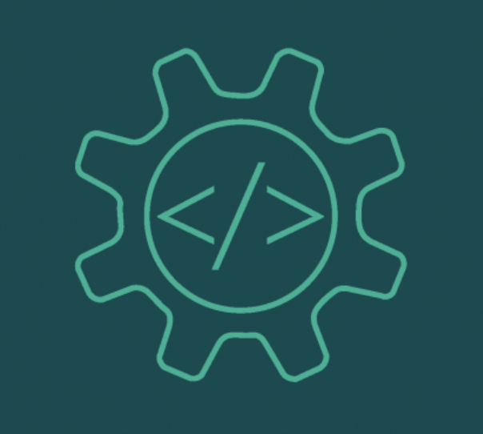

## Introduction

For most people when coding, they worry about if the code will work or how to even code. Though these are valid thoughts to have, an important topic that gets overlooked is coding standards. Knowing what the coding standards are and implementing it into your code is very important if you want to be the best you can be. It’s very important because if you made a mistake, it will tell you right away what the error is. From there, you can search up the error and figure out what is wrong with your code and fix it. This will help you to learn from that mistake, so when you encounter something similar, you will know what to do to avoid that error. Not only can it help with finding errors, but it will help make your code cleaner and easier to read. I feel that a lot of beginners don’t understand how important clean and legible code is. It’s ten times harder to read a block of code that isn’t properly indented or spaced out. That is why there are tools that can help with these issues such as ESLint. Image retrieved [here](https://www.microsoft.com/en-us/research/group/research-software-engineering-rise/).

## What is ESLint?

ESLint is a tool that can help you with your code in Javascript. It can tell you your errors and how to fix them. If you don’t really understand what it’s saying you can just search it up and the answers online. It is such a convenient tool that can make your code that much better. Without it, coding would be very hard, especially for beginners, because we don’t know how to fix errors right away. Also it would be difficult to even find the errors without tools like ESLint. Comparing ESLint to another tool for Java, Checkstyle, ESLint reigns supreme. ESLint is very easy to understand when they give you errors. Most of the time you don’t have to search up the meaning of the errors because they are so straight up with how to fix the error. For me, I like when there is errors now because it gives me a chance to learn from my mistakes. I'm not annoyed at them because they are very easy to fix. 

## Conclusion

To sum everything up, coding standards are important for every coder whether you’re a beginner or experienced. In my personal experience, I never really cared or even thought about the cleanliness of my code or how easy it is to read. That was until I started to use Checkstyle for my Java code. Checkstyle was very hard to understand and I would have to look up a lot of things just to understand a simple error that occurred. This experience made me dislike errors and fixing them all the time. That is until I started to use ESLint, which helped me out a bunch instead of deterring me away from actually fixing my code. Now I can fix my code in a decent amount of time and overall it’s making me better at coding because I know what the standards are. If you are a beginner or even an expert and you don’t follow the coding standards, I would highly recommend that you do. It will help you out a bunch and make you an amazing coder.

