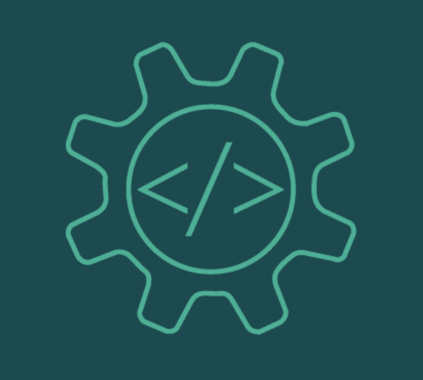

## Switching Majors

Before I was majoring in Computer Science, I was a Mechanical Engineering major. For the first year of college I was questioning my decision with my major because I didn't really have any interest in mechanical engineering. Thankfully, we were required to take ICS 111 which is the start of my computer science journey. It was in that class that I fell in love with coding. Even though it was scary to switch my major, I did it and I haven't looked back since. 

## The Software Engineering World

Now that I switched majors, I did some research on the job opportunities that come with a degree in Computer Science. The one job that interested was Software Engineering. I didn't know that much about it other than it was a job that I could apply for. Reading into it more I feel that it would be the perfect job for me. As a software engineer, you have to design, develop, and maintain software. Not only that but you have to be able to collaborate with your peers to work through some problem that you may encounter. You have to think carefully on the problems and be able to fix any issues that are thrown at you. I think that this is the part that excits me about software engineering. Being able to work with other like-minded people working toward the same goal. This field is so big and vast that there has to be multiple people working togther to get through thousands of lines of code at times. For me personally, I feel that I work better with others just so that I can bounce my ideas off on each other. It makes it much easier to be working with others because every single person has their own view on a situation so its important to communicate with them so you have multiple angles of viewing the situation. Another thing that I'm interested in is just coding. This world is changing and growing all the time. We will have to adapt and learn as we go on. That's the exciting part, that we won't stop learning because there will always be something to learn in this field of work. 

## Skills That I Need

Being in this field of work there are a lot of skills that I want to have in the future. Firstly, I would hope that my coding skills improve. I want to be able to code what I'm think faster. Also I want to be able to code in multiple language not just Java and Javascript. Secondly, I want to improve the way that I talk about code. What I mean when I say that is when I try to explain my code to someone else, I want to be able to be clear and precise so they can understand it easier. Thirdly, I want to strengthen my mental strength. I don't want to get fustrated or discouraged so easily just because I can't solve a problem. If that happens I need to stop and do something else for a bit. This way it takes my mind off the problem and it can give my brain some time to rest. Finally, I would like to work on y communication in terms of asking for help. I noticed that whenever I have a question I always question if I should ask someone the question because I don't know if its a valid one to ask. I need to remember that my peers are in the same situation as I am and they are probably stuck on the same problem as me. Then we could help each other with the problem and work it out together.

## Experiences That I Want

In terms of experiences, I would like to get an internship somewhere on the mainland. I really want to go to the mainland because there is so much more opportunities there than here in Hawaii. I wanna be challeneged by the new atmosphere and culture as well. Living on the mainland will be an experience that I need to not only grow as a software engineer, but as a person. Another experience that I want to do in the future is competing in a coding competition of some sort. I have never competed before and I feel that I would have a lot of fun doing it. I think that it would be fun to be coding with a bunch of my friends. Working together will help me with my commuication skills and give me an environment where I work in a group setting.

## Conclusion

Overall, software engineering, I fell, is a perfect fit for me as a career. I love to work with others and bounce ideas off of each other. Working with like-minded people will help me get to my goals and make me work harder. I know that there will be obstacles in my way, I can't wait to see what the future has in store for me.
