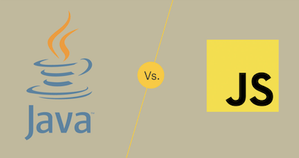

Starting a new coding language can be tough. Especially, when you're so used to coding a certain way. With Javascript though, it is fairly simple.

## The Beginning 

I started coding at the beginning of college so I am very new. The only other language that I knew was Java. Knowing Java really helped me understand Javascript more. If you are good with one language it will be easy to understand the basics of Javascript. Even though it's only been two weeks into the semester, I feel more confident in Javascript than I do in Java at this point. It's that easy! Yes, there are some topics that are hard but that's where practice comes into play.

## About Javscript

Javascript is a very beginner-friendly language. It is much easier to understand than trying to learn Java as your first language. For example, you don't have to specify what input you want to put in unlike Java where you have to state if it a int or a string. Just using the words "let" and "const" we can make variables in Javascript. There aren't as many rules as there are in other languages. Also if you want to make a function you can just write "function" and then the name of it and you're done. Even though it is easy, this means that there can be errors in this language that wouldn't usually happen in other languages doue to the ambiguity of Javascript.

## JSFiddle vs. Eclpise

I wanted to point out as well that the platform that we use for Javascript, JSFiddle, is much easier to use than what we would use for Java, Eclipse. JSFiddle's platform is very simple versus Eclipse which has so much buttons I don't even know what to do with them. I know that there are a lot of shortcuts that you can do with Eclipse, but it's so complicated that I can't use them. For me, JSFiddle has been great even though there are some problems. 

## WOD's and BWOD's

The WODs are something that I didn't expect to be doing in this class. With that being said, I'm happy that we are doing them. Yes, they are challenging, but they're challenging in a good way. They are helping us think not only harder but faster. It is pretty stressful with the timelimit, but that's only there to challenge us. Also the BWODs are very hard, but I like that though. I think that the hardest part of these are trying to do it in the time limit because I'm still fairly new to coding, so it takes me longer to write out my thoughts. I can understand the problem and solve it in my head, but right now I'm not fast enough to finish. Thats okay though, because I'll just keep on practicing it until I'm capable.

## Conclusion

All in all, I'm happy that I'm learning a new language this semester. Javascript is so much easier than Java and I'm enjoying it a lot. It is a beginner-friendly language unlike Java. There aren't as many rules in this language as well which is very convenient. I'm having a lot of fun in this class and its only the second week! I'm excited to see what this class has in store for me later on in the semester. 
