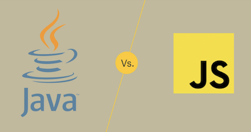

## The Beginning 

At the beginning of this semester I didn't know what to expect. All of my classes were still online and I was stuck in my room. Out of all of my classes that I've taken this semester, I was the most excited for ICS 314. I really was and still am interested in learning about software engineering since this was my first experience ever. I didn't know what to expect but I was ready for whatever was coming my way! Image retrieved [here](https://www.lifewire.com/difference-between-java-and-javascript-4777619).

## Coding Standards

I think the one thing that will stick with me the most would have to be coding standards. Having good coding standards is very important expecially when you're working with a group of people. Knowing the coding standards can help you out in the long run because if you see that there's an error, you'll be able to fix it right away. There are tools that can help out a ton with this such as ESLint. For most of the semester, we were using ESLint and I loved it. If there is an error in you code ESLint will tell you right away. Once you hover over the error, it gives you a very simple reason of why it is wrong so you can fix it. 

## Agile Project Management

Another topic that I learned about was agile project management. Agile projet management is a method of working in part so that you can be continuously be improving and progressing in your project. You can split up the workload into different issues so that the task seem smaller and more achievable to finish in a shorter time frame. Using this while working with a group is very helpful because everyone can do a couple of issues each and together can get the job done faster. Everyone will have something to work on at all times without anyone interferring or doing the same issue.

## Conclusion

Throughout this class, I have learned a lot such as, configuration management, design patterns, and ethics in software engineering. The two what I stuck out to me were coding standards and agile project management. Coding standards are important so that you can have your code be clean and easy to understand when workign as a group. Also using ESLint can help a ton with finding errors and fixing it. Agile project management is also important to finish bigger project. Splitting tasks into smaller issues will make things run faster and it'll help get the project done. With that being said, I still have a lot to learn but I'm happy that I took this class because it gave me a good foundation and starting knowledge into software engineering.

