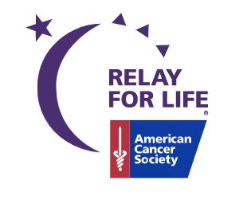

For my senior project, I decided to talk about lung cancer. I chose this topic because my grandpa passed away due to lung cancer and I wanted to do this in honor of him. In order to pass, we had to do a presentation for about 15 minutes, do 25 hours of community service, and a ton of research. When reasearching, I learned that there are so much that thing that people don't know about lung cancer and how it can truely affect someone physically and mentally. It was very hard to cram all of the material into my presentation because there was a lot of important information for everyone to know. Image retrieved [here](https://secure.acsevents.org/site/SPageServer?pagename=relay).

For community service, I decided to volunteer at Relay for Life. Relay for Life is a fundraiser for the American Cancer Society that spreads awareness for cancer. I helped by setting up the tables and chairs, put up signs and posters, helped with directing people in the parking lot, and even worked in a food truck! Overall, it was such a great experience to be at the events. All of the people there were so friendly and kind. I would recommend you to go to one of the events.

Overall, this project was very hard, but very rewarding. There were a lot of late nights working on this, but it was worth it at the end. The presentation part helped me become more confident talking in front of people. The research part helped me recognize which sources are reliable and which are not. The most rewarding part was the community service that I did. Even though I had to work the whole day I was there, I was able to support the community and give back.
