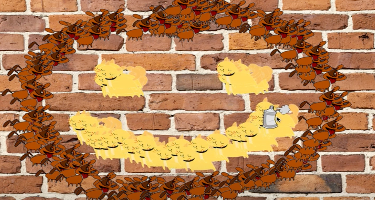

  

Before taking ICS 111 I had no prior experience with coding. This was a whole new world for me and I was very scared because computer science is a hard major. Doing this project really opened my eyes to the possiblilties of coding and what I could do. Once I finished the project, I felt relieved but most importantly excited because I wanted to know what else I could do. Even though this project is fairly simple, it made me feel like I could do anything and I belonged in this major.

"Graffiti Wall" is a simple game with no objective. The whole point of this project was to learn how to code, but also to have fun with it. It was made with JAVA which was very hard to understand since I was a newbie. From this project I learned how to code a randomizer and a picture that will follow my cursor. On top of that, we learned how to add sounds when we pressed buttons. I got a lot of practice with simple concepts such as if statements and for loops. Overall, this project was one of my favorite moments coding that I will never forget!

This is a link to the youtube video of "Graffiti Wall": https://www.youtube.com/watch?v=wtv7Y137whI

