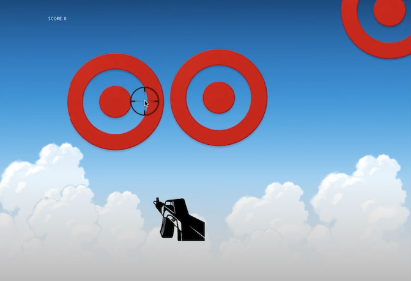

This was my final project for ICS 111. It was a group project so I worked with my friend on this. We both barely had any experience with coding so we worked very hard on it. At the end, it didn't turn out the way that we wanted it to, but we did finish the core ideas that we wanted in the project. The objective of this game is to shoot the target that float by the screen. We implemented a score system, which is shown on the top left of the screen. We learned how to make objects move across the screen and how to make objects dissapear if it was clicked on. 

Throughout this project my partner and I struggled with figuring out the coding portion of this project. We really had to work together for this project on every part of it. The biggest takeaway's that I got from this project was that communication is very important and collaboration is vital and also fun. My communication skills grew immensely throughout this. Collaborating with my friend was a lot of fun because we got to bounce ideas off eachother and problem-solve with each other.

This is a link to the youtube video of “Target Hunt: [Target Hunt](https://www.youtube.com/watch?v=sEJiVE-5VSM)

