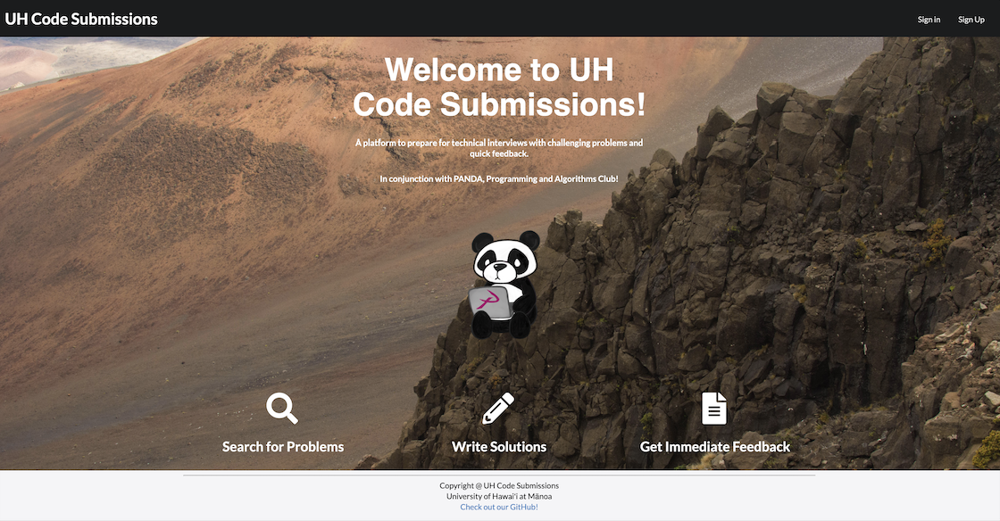

This is my final project for ICS 314. I worked on this with three of my classmates and we called the website "UH Code Submissions." This website was designed for the PANDA club to use and it helps computer science students at UH Manoa practice interview-like problems. 

On our website we implemented a lot of features such as a sign-in/ sign-up page, problems page, profile page, and many more. The sign-in page will let existing members log into the website and if you don't have an account already there is a sign-up feature that you can fill out to register an account with us. The problems page has all of the problems that the admin has added to it. From there the users can see what the different problems are and then once they see a problem that they want to solve, they can click on it to type in their answers. When they click on it, they will be moved to the solutions page where they can answer the problems and then submit it to the admin for review. Finally, there is the profile page. The profile page will show a picture of you along with the data that you gave to the admin when you registered. you can also see the solutions that you have submitted along with a meme of the day. 

I helped out with making the mock up pages for the pages that we implemented. I also worked on the problems page by making the cards and adding the problems as well. I also worked on the homepage to make sure that the pictures and text were up to date.

Working on this project was difficult, but a lot of fun as well. There was a couple of long nights throughout this, but it was worth it at the end because we finished the website that we wanted. There were a couple of pages that we wanted to implement, but we didn't have time. Even though we couldn't add this pages, the final product that we have exceeded our expectations and I couldn't be prouder.

This is a link to the homepage for UH Code Submissions: [UH Code Submissions](https://uh-code-submissions.github.io/)

